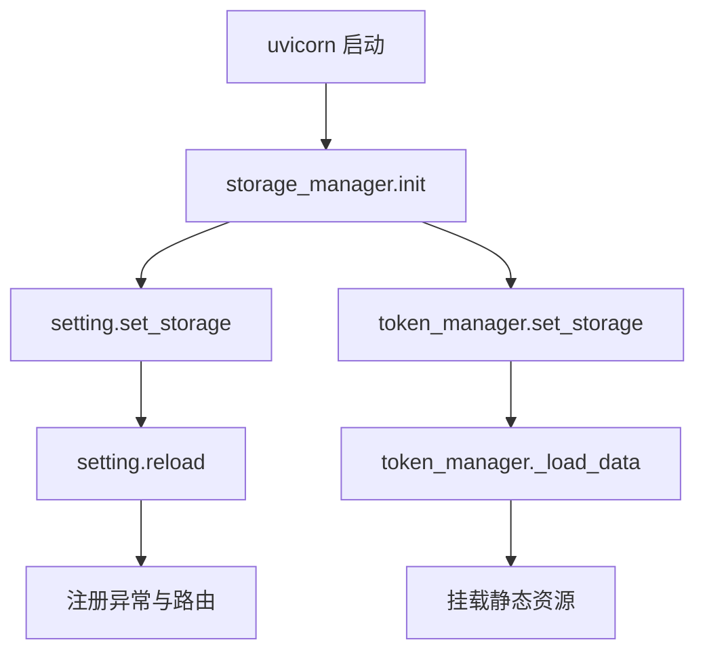
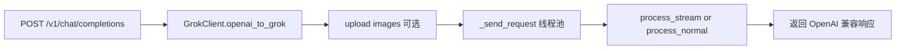

# Agents 初始化规划与决策

本文件汇总本次针对 AI 助手的规则抽取与约束梳理，聚焦非显而易见且项目特有的信息，作为后续协作的权威依据。

## 目标
- 生成精简且高价值的 AGENTS 指南文件，避免显而易见与框架默认信息。
- 衍生模式专属规则，覆盖 Code/Debug/Ask/Architect 场景。
- 固化关键命令、架构耦合点与隐含约束，避免常见踩坑。

## 技术栈与运行
- Python 3.11、FastAPI、Uvicorn、curl_cffi、aiofiles、aiomysql、redis。
- 容器暴露端口 8000（[Dockerfile](Dockerfile:37)、[docker-compose.yml](docker-compose.yml:5)）；直接运行 [uvicorn.run](main.py:80) 默认 8001，开发统一用 8000：
```bash
# 本地开发
uvicorn main:app --host 0.0.0.0 --port 8000
```

## 非显而易见命令与调试
- 流式最小复现（SSE）：
```bash
curl -N http://localhost:8000/v1/chat/completions \
  -H "Content-Type: application/json" \
  -H "Authorization: Bearer <token>" \
  -d "{\"model\":\"grok-4-fast\",\"messages\":[{\"role\":\"user\",\"content\":\"hi\"}],\"stream\":true}"
```
- 健康检查与非流式最小调用见 [AGENTS.md](AGENTS.md:1)。

测试框架未配置（未发现 pytest、tox、nox 与相关 ini），当前以 curl 端到端校验为主。

## 架构关键流程
- 启动生命周期（必须顺序）：
  1) 初始化存储 [StorageManager.init()](app/core/storage.py:451)
  2) 注入存储到设置与令牌管理 [main.py](main.py:24) 到 [main.py](main.py:27)
  3) 二次加载配置与 token [main.py](main.py:29) 到 [main.py](main.py:30)
  4) 注册异常、路由并最后挂载静态资源 [main.py](main.py:52) 到 [main.py](main.py:62)
- 聊天请求管线：
  - 入口 [chat_completions](app/api/v1/chat.py:22) → [GrokClient.openai_to_grok()](app/services/grok/client.py:28) → 同步 HTTP 下放线程池 [GrokClient._send_request()](app/services/grok/client.py:169) → 响应处理 [process_stream()](app/services/grok/processer.py:223) 或 [process_normal()](app/services/grok/processer.py:81)。

## 关键约束与坑位
- x-statsig-id 必填：缺失即抛错（[get_dynamic_headers](app/services/grok/statsig.py:19)）。默认值在 [data/setting.toml](data/setting.toml:6)。
- 代理自动升级：socks5:// 自动重写为 socks5h://，使用远程 DNS（[ConfigManager.load](app/core/config.py:31)）。
- token.json 键名陷阱：运行期期望 ssoNormal/ssoSuper（[TokenType](app/models/grok_models.py:86)、[token_manager.get_tokens](app/services/grok/token.py:161)）；而文件存储初始写入 sso/ssoSuper（[FileStorage.init_db](app/core/storage.py:64)）。本地开发请迁移为：
```json
{"ssoNormal": {}, "ssoSuper": {}}
```
- 存储模式切换：STORAGE_MODE 为 mysql 或 redis 时必须提供 DATABASE_URL，否则启动短路失败（[StorageManager.init](app/core/storage.py:466)）。
- 媒体本地回源：所有图片/视频缓存到 data/temp 并通过 [/images](app/api/v1/images.py:13) 回源；响应内链接依赖 base_url，反代未设置将导致 404（[process_normal](app/services/grok/processer.py:176)、[process_stream](app/services/grok/processer.py:323)）。
- 视频模型契约：仅一张图，强制追加 --mode=custom，并以进度事件驱动完成后返回 video 标签（[openai_to_grok](app/services/grok/client.py:47) 到 [app/services/grok/client.py](app/services/grok/client.py:56)、[process_stream](app/services/grok/processer.py:298) 到 [app/services/grok/processer.py](app/services/grok/processer.py:320)）。
- 阻塞 I O 卸载：对 Grok 的同步 HTTP 请求必须使用 asyncio.to_thread 下放线程池，避免阻塞事件循环（[GrokClient._send_request](app/services/grok/client.py:169)）。
- 统一异常：对外抛 [GrokApiException](app/core/exception.py:9)，全局映射为 OpenAI 兼容错误（[register_exception_handlers](app/core/exception.py:115)）。

## 令牌选择与限速
- grok-4-heavy 仅使用 Super Token，按 heavyremainingQueries 选择（[token_manager.select_token](app/services/grok/token.py:214)）。
- 其他模型优先 Normal，不可用回退 Super（[token_manager.select_token](app/services/grok/token.py:222)）。
- 限速查询异步旁路更新（成功响应后触发），调用方不要同步依赖（[GrokClient._process_response](app/services/grok/client.py:231) 到 [app/services/grok/client.py](app/services/grok/client.py:237)、[token_manager.check_limits](app/services/grok/token.py:244)）。

## 已产出文件
- 主规则：[AGENTS.md](AGENTS.md:1)
- Code 模式：[.roo/rules-code/AGENTS.md](.roo/rules-code/AGENTS.md:1)
- Debug 模式：[.roo/rules-debug/AGENTS.md](.roo/rules-debug/AGENTS.md:1)
- Ask 模式：[.roo/rules-ask/AGENTS.md](.roo/rules-ask/AGENTS.md:1)
- Architect 模式：[.roo/rules-architect/AGENTS.md](.roo/rules-architect/AGENTS.md:1)

## Mermaid 流程图

启动生命周期


聊天请求管线

